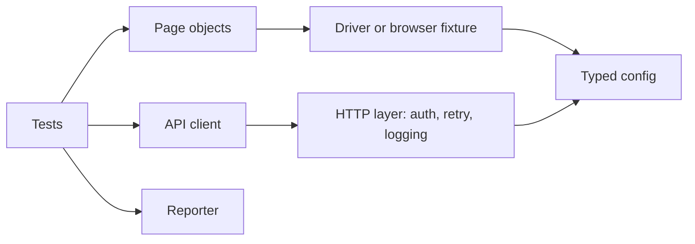

# Architecture

Replace this with the real diagram and layer description for this framework
during the first week. Keep the Mermaid block: GitHub renders it natively, so
the README shows a real diagram with no image hosting.

## Layers

| Layer | Holds | Never holds |
|---|---|---|
| Tests | Assertions, one behaviour each | Selectors, waits |
| Page objects | Actions and queries | Assertions, test data |
| API client | Setup, teardown, seeding | UI knowledge |
| HTTP layer | Auth, retry, redaction, logging | Business logic |
| Config | Typed environment values | Secrets in source |
